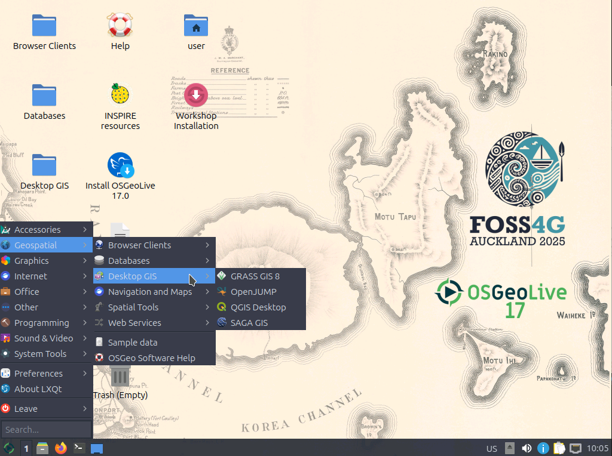

# Workshop PostgreSQL/PostGIS für Einsteiger

[FOSSGIS 2026 Göttingen Workshop 25. März 2026](https://www.fossgis-konferenz.de/2026/)

 


[](https://creativecommons.org/licenses/by-sa/4.0/deed.de)


## Jörg Thomsen

* Jörg Thomsen
* WhereGroup GmbH 
* joerg.thomsen@wheregroup.com

## Nimrod Gavish
* WhereGroup GmbH
* Nimrod.Gavish@wheregroup.com


* FOSS Academy https://www.foss-academy.com/


<br><br><br>
### Original Workshopmaterial: Astrid Emde

* Astrid Emde
* WhereGroup GmbH
* astrid.emde@wheregroup.com


<br><br><br>

# Womit wird der Workshop durrchgeführt?
## OSGeoLive


Dieser Workshop nutzt OSGeoLive (https://live.osgeo.org) Version 17.0 (Release Januar 2026 -https://osgeo.github.io/OSGeoLive-doc/en/index.html) in einer für die FOSGIS 2026 angepassten Variante (https://cloud.fossgis.de/s/Ba5yDcq5R6HGySD). OSGeoLive basiert auf Lubuntu und beinhaltet eine Kollektion aus nahezu 50 vorinstallierten Software-Projekten. OSGeoLive beinhaltet außerdem Beispieldaten, die für diesen Workshop verwendet werden.



OSGeoLive kann über den folgenden Link heruntergeladen werden. Sie können OSGeoLive in einer Virtuellen Maschine (empfohlen) oder über einen USB-Stick nutzen.

* Download OSGeoLive Image http://live.osgeo.org/en/download.html
* Dokumentation https://live.osgeo.org/
* PostGIS-Übersicht (OSGeoLive Overview) https://live.osgeo.org/en/overview/postgis_overview.html
* PostGIS-Einstieg (OSGeoLive Quickstart) https://live.osgeo.org/en/quickstart/postgis_quickstart.html


## Aktuelle Software Version 

* PostgreSQL 18.2 (2025-02-09) https://www.postgresql.org/
* PostGIS 3.6 (2025) https://postgis.net/


### OSGeoLive 15.0

* PostgreSQL 16.13
* PostGIS 3.5.0

```sql
SELECT version(), postgis_version(), postgis_full_version();
```


## Daten

* Natural Earth II
 * Daten liegen als ESRI Shapedateien vor - Länder, Bundesländer, Flüsse, Orte & mehr unter /home/user/data
 * Datenbank: natural_earth2
* OpenStreetMap
 * Datenbank: osm_local

<br><br><br>

> [!NOTE]
> ## Zusätzliche Information
> 
> * PostGIS in Action (August 2015, 2. Auflage) Regine Obe, Leo Hsu ISBN 9781617291395
> * Paul Ramsey PostGIS Day 20019 - Everything about PostGIS https://www.youtube.com/watch?v=g4DgAVCmiDE
> * Paul Ramsey Blog Clever Elephant http://blog.cleverelephant.ca/
> * MapScaping Podcast Paul Ramsey Spatial SQL - GIS without the GIS https://mapscaping.com/blogs/the-mapscaping-podcast/spatial-sql-gis-without-the-gis
> * Clever Elephant ;) https://www.youtube.com/watch?v=Gw_Q1JClH58
> * Postgres OnLine Journal Regine Obe, Leo Hsu http://www.postgresonline.com/
> * Modern SQL Blog Markus Winand https://modern-sql.com/slides https://use-the-index-luke.com/
> * PostgreSQL books https://www.postgresql.org/docs/books/
> * Geomob Podcast - 88. Paul Ramsey: PostGIS turns 20 https://thegeomob.com/podcast/episode-88
> * PostGIS at 20, The Beginning Paul Ramsey: http://blog.cleverelephant.ca/2021/05/postgis-20-years.html
> * FOSSGIS 2021 20 Jahre PostGIS - dazu 20 hilfreiche Tipps zu PostGIS und Neuigkeiten rund um das Projekt (Astrid Emde, german) https://pretalx.com/fossgis2021/talk/NL3FAN/
> * FOSSGIS 2020 Verbindungen schaffen mit PostgreSQL Foreign Data Wrappern (Astrid Emde, german) https://pretalx.com/fossgis2020/talk/ZP3JZZ/
> * pgRouting: A Practical Guide (Mai 2017, 2. Auflage) Regine Obe, Leo Hsu ISBN: 9780989421737
> * Information zu Projektionen http://spatialreference.org/
> * Virtueller PostGIS Day 2021 https://info.crunchydata.com/en/postgis-day-2021
> 
> ## Warum lohnt sich der Einsatz einer Datenbank?
> 
> * zentrale Datenhaltung - keine Datenredundanz
> * Konsistenz der Daten
> * Mehrbenutzer-Zugriff
> * Kontrollierter Zugriff über Zugriffskontrolle und -management
> * Zugriff auf die Daten über unterschiedliche Werkzeuge
> * Kombination von unterschiedlichen Daten - datenbankweit, datenbankübergreifend und auf Fremdquellen
> * SQL zur Generierung und Analyse der Daten
> * Backup, Replikation ...
>   
> 
> ## PostgreSQL
> 
> * Unterstützt von zahlreichen anderen Programmen
> * Schnell, leistungsstark, verlässlich, robust
> * Einfach zu Warten
> * Folgt SQL Standards
> * Schnittstelle zu vielen Programmiersprachen
> * Subselects, Funktions, Trigger, Foreign Data Wrapper, Replikation & mehr
> * https://www.postgresql.org/about/
> 
> 
> ## PostGIS
> 
> * Erweiterung (Extension) für PostgreSQL
> * PostGIS übernimmt die Arbeit, die sonst das DesktopGIS gemacht hat
> * Folgt Standards:
>  * OGC Simple Feature Spezification for SQL 
>  * OGC ISO SQL/MM Spezification 
> * Stellt zahlreiche räumliche Funktionen bereit
> * Breite Unterstützung durch andere Programme
> * Leichter Import / Export von räumlichen Daten (QGIS DB-Verwaltung, shp2pgsql, pgsql2shp, ogr2ogr, dxf2postgis, osm2pgsql)
> * Die Vorteile von PostgreSQL können genutzt werden (Benutzerverwaltung, Replication, Indezierung & mehr)
> * Sehr leistungsstark: Unterstützung von Vektor- & Rasterdaten, geometry (planar Daten) und geography (spheroid), kreisförmige Objekte, 3D-, 4D-Objekte, Punktwolken, Routing über pg_routing, Topologien, Generierung von MVT & GeoJSON
> * Daten werden als WKB (Well-known Binary) gespeichert. WKT (Well-known text) zur lesbaren Ausgabe.
> * http://postgis.net/
> * http://postgis.net/docs/
> 
> PostGIS wurde am 21. Mai 2021 zwanzig Jahre alt!
> 
> 
> 
> * PostGIS at 20, The Beginning Paul Ramsey: http://blog.cleverelephant.ca/2021/05/postgis-20-years.html
> 
> PostGISDay - immer am 3. Donnerstag im November
> 
> * https://twitter.com/search?q=PostGISDay
> * https://postgisday.rocks/

<br><br><br>

## Was ist überhaupt eine Datenbank? Was ist PostgreSQL?
* Eine Datenbank ist ein digitales Repository zum Speichern, Verwalten und Sichern organisierter Datensammlungen.
* Eine Datenbank ist ein abgeschlossenes System
* PostgreSQL ist ein Relationales Datenbank Management System (RDBMS)
  * kann eine oder mehrere Datenbanken beinhalten
  * jede Datebank hat eigene Tabellen, Funktionen, Erweiterungen etc. -> Datenbankobjekte
 
  
## Datenbank-Clients
* pgAdmin 4 https://www.pgadmin.org/
* psql kommandozeilen basierter Client https://www.postgresql.org/docs/current/static/app-psql.html
* QGIS DB-Verwaltung - integriert in QGIS
* DBeaver https://dbeaver.io/
* und viele mehr

<br><br>
### Übung 1: pgAdmin und erste Schritte im Umgang mit der Datenbank
```
1. Öffnen Sie pgAdmin über Start -> Geospatial -> Datenbank -> pgAdmin4 (Passwort: user)
2. Die auf dem Rechner vorhandenen Datenbanken sind bereits eingebunden
3. Gehen Sie in der Datenbank natiuralearth2 das Schema public und schauen Sie sich die Tabelle ne_10_lakes an
4. Öffnen Sie die Tabelle und schauen Sie sich die Geometriespalte (geom) an. Können Sie die Geometrie lesen?
5. Sehen Sie sich die Seen im Geometry Viewer an
```

### Well-Known Text Format (WKT) und Well-Known Binary Format (WKB) 

Die Geometrien werden intern im Well-Known Binary Format (WKB) gespeichert. Eine lesbare Ausgabe ist über das Well-Known Text Format (WKT) möglich.


http://postgis.net/docs/using_postgis_dbmanagement.html#OpenGISWKBWKT


ST_AsEWKT oder ST_AsText zur Anzeige der Geometrie als Text

```sql
SELECT ST_AsText(geom), geom FROM ne_10_lakes; -- mit SRID
SELECT ST_AsEWKT(geom), geom FROM ne_10_lakes; -- ohne SRID
```
<br><br><br>

> [!NOTE]
> ## Zusätzliche Information
> ### Wie erfolgt die Kommunikation mit der Datenbank?
> 
> * über SQL - Structured Query Language
> * DDL - data definition language
> * DML - data manipulation language
> * DQL - data query language 
> 
> 
> ### DQL
> 
> * DQL - zur Abfrage von Daten (DQL ist ein Teil der DML) 
> z.B. zur Anzeige aller Daten aus der Tabelle **_spatial_ref_sys_**, bei denen srid = 4326 ist.
> 
> ```sql
> SELECT * FROM spatial_ref_sys WHERE srid=4326;
> ```
> 
> ### DDL 
> 
> * DDL zur Erzeugung von neuen Strukturen wie Datenbanken, Tabellen, Rollen, Schemata & mehr.
> 
> ```sql
> CREATE DATABASE demo;
> ```
> 
> * Verbinden Sie sich mit der Datenbank **_demo_**. Frischen Sie 
> dazu die Liste der Datenbanken auf und wählen Sie anschließend die Datenbank **_demo_** aus.
> 
> 
> * Laden Sie die Erweiterung **_postgis_**.
> 
> ```sql
> CREATE EXTENSION postgis;
> ```
> 
> * Erzeugen Sie die Tabelle **_poi_**.
> 
> ```sql
> CREATE TABLE pois(
>  gid serial PRIMARY KEY,
>  name varchar,
>  year int,
>  info varchar
> );
> ```
> 
> Änderungen der Tabellenstruktur
> 
> ```sql
> ALTER TABLE pois ADD COLUMN land varchar;
> ALTER TABLE pois RENAME land TO country;
> ALTER TABLE pois DROP COLUMN country;
> ALTER TABLE pois ADD CONSTRAINT pk_gid PRIMARY KEY (gid); 
> ```
> 
> Löschen einer Tabelle
> 
> ```sql
> DROP TABLE pois;
> ```
> 
> ### DML
> 
> * Manipulation von Daten - Erzeugen, Löschen, Verändern von Daten
> 
> ```sql
> INSERT INTO pois (name, year, info) VALUES 
> (
> 'Kölner Dom',
> 1248,
> 'https://en.wikipedia.org/wiki/Cologne_Cathedral'
> );
> ```
> 
> ```sql
> UPDATE pois SET name = 'Cologne Cathedral' WHERE name = 'Kölner Dom';
> ```
> 
> 
> ```sql
> -- Löscht Datensätze mit name "Cologne Cathedral"
> DELETE FROM pois WHERE name = 'Cologne Cathedral';
> -- Löscht alle Datensätze der Tabelle
> DELETE FROM pois; 
> -- Löscht Datensätze mit gid > 1111
> DELETE FROM pois WHERE gid > 1111;
> ```

<br><br><br>

### Übung 2: Erzeugen einer Datenbank mit PostGIS-Erweiterung
``` 
1. Legen Sie eine Datenbank mit dem Namen fossgis an
   Hinweis: Nutzen Sie Kleinbuchstaben und keine Leerzeichen für den Namen von Datenbanken,
   Tabellen und Spalten! Dies erleichtert den Umgang, da Sie dann keine Anführungszeichen (")
   nutzen müssen (bei Großschreibweise "FOSSGIS")
2. Verbinden Sie sich mit Ihrer Datenbank
3. Laden Sie die Erweiterung postgis
``` 
```sql
CREATE DATABASE fossgis;
```
```
4. Wechseln zur Datenbank fossgis
```
```sql
CREATE EXTENSION postgis;
```

<br><br><br>

### Übung 4: Erzeugen und befüllen Sie die Tabelle cities
``` 
Erzeugen Sie eine neuen Tabelle mit dem Namen cities mit den Spalten gid, name, country und geom an,
erstellen sie einen Index auf der Geometriesaplte und
befüllen sie die Tabelle per SQL mit ein paar Einträgen
```
```sql
CREATE TABLE cities(
    gid serial PRIMARY KEY,
    name varchar,
    country varchar,
    geom geometry(point,4326)
    );

CREATE INDEX idx_cities_geom ON public.cities USING gist (geom);
```
```sql
INSERT INTO cities(name, geom, country)
    VALUES ('Firenze',ST_SetSRID(ST_MakePoint(11.256944,43.773056),4326),'Italy');
```
```sql
INSERT INTO cities(name, geom, country)
    VALUES ('Buenos Aires',ST_SetSRID(ST_MakePoint(-58.394002,-34.581619),4326),'Argentina');
```
```sql
INSERT INTO cities(name, geom, country)
    VALUES ('Bucharest',ST_SetSRID(ST_MakePoint(26.096306 , 44.439663),4326),'Romania');
```
```sql
INSERT INTO cities(name, geom, country)
    VALUES ('Dar es Salaam',ST_SetSrid(ST_MakePoint(39.273933, -6.812810),4326),'Tanzania');
```
```sql
INSERT INTO cities(name, geom, country)
    VALUES ('Cologne',ST_SetSRID(ST_MakePoint(6.958307 , 50.941357),4326),'Germany');
```
```sql
INSERT INTO cities(name, geom, country)
    VALUES ('Berlin',ST_SetSrid(ST_MakePoint(13.41053 , 52.52437),4326),'Germany');
```

```sql
-- Man kann auch mehrere Datensätze aufeinmal einfügen:
-- die beiden -- leiten übrigens einen Kommenatar in einem SQL-Skript ein
INSERT INTO cities(name, geom, country)
    VALUES 
  	('Firenze',ST_SetSRID(ST_MakePoint(11.256944,43.773056),4326),'Italy'),
	  ('Buenos Aires',ST_SetSRID(ST_MakePoint(-58.394002,-34.581619),4326),'Argentina'),
	  ('Bucharest',ST_SetSRID(ST_MakePoint(26.096306 , 44.439663),4326),'Romania'),
	  ('Dar es Salaam',ST_SetSrid(ST_MakePoint(39.273933, -6.812810),4326),'Tanzania'),
	  ('Cologne',ST_SetSRID(ST_MakePoint(6.958307 , 50.941357),4326),'Germany'),
	  ('Berlin',ST_SetSrid(ST_MakePoint(13.41053 , 52.52437),4326),'Germany');
```


## QGIS zur Anzeige der Daten

* Sie können Ihre Daten mit QGIS anzeigen, bearbeiten und Daten nach PostgreSQL importieren oder exportieren
* Sie benötigen die Verbindungsparameter für den Zugriff auf die Datenbank - nur berechtigte Benutzer können sich mit den Daten verbinden


 
### Übung 5: QGIS: Anzeige von Daten aus der Datenbank **_natural_earth2_** und fossgis
``` 
1. Öffnen Sie QGIS (Geospatial -> DesktopGIS -> QGIS) und erstellen Sie ein neues QGIS-Projekt
2. Laden Sie die Ländergrenzen, Bundesländer, städtische Bereiche (urban areas) und Ortschaften
   (populated places) aus der Datenbank natural_earth2
3. Legen Sie eine neue PostGIS-Verbindung für Ihre neue Datenbank fossgis an
4. Laden Sie die neuen Tabelle cities
5. Fügen Sie über die QGIS Digitalisierung einen neuen Punkt in Ihre Tabelle cities für Ihren
   Wohnort und Göttingen ein.
6. Überürfen Sie in pgAdmin die neuen Einträge in der Tabelle
``` 

<br><br><br>
> [!NOTE]
> ## QGIS: Import von Daten nach PostgreSQL über die QGIS DB-Verwaltung
> 
> Die QGIS DB-Verwaltung bietet eine komfortable Möglichkeit zum Import und Export von Daten. Sie finden die QGIS DB-Verwaltung im Menü unter *Databanken -> DB-Verwaltung*. Sie benötigen einen Datenbankverbindung für den Zugriff auf die Daten.
> 
> Laden Sie die Daten, die Sie laden möchten, am Besten in ein QGIS-Projekt. Die Daten können auch gefiltert werden, so dass Sie auch nur einen Auszug der Daten in die Datenbank laden können.
> 
> Der Import erfolgt über die folgenden Schritte:
> 
> 1. Öffnen Sie die QGIS DB-Verwaltung
> 1. Verbinden Sie sich mit Ihrer Datenbank
> 1. Wählen Sie den **Import**-Button
> 1. Wählen Sie die Daten für den Import aus
> 1. Definieren Sie einen Namen für die Tabelle, den EPSG-Code und fügen Sie einen Primärschlüssel hinzu
> 1. Erzeugen Sie einen räumlichen Index
> 1. Starten Sie den Import
> 1. Fügen Sie die Daten nach dem Import per drag & drop in Ihr QGIS-Projekt
> 
> 
>  
> 
> ## QGIS: Erstellen von Tabellen via QGIS
> 
> Neue Tabellen können ganz einfach auch in QGIS erstellt werden. Dies erfolgt über die DB-Verwaltung unter dem Menüpunkt **_Tabelle -> Tabelle erzeugen_**.
> 
> 

<br><br><br><br><br><br>

# PostGIS-Funktionen in Aktion

* PostGIS Dokumentation http://postgis.net/docs/
* PostGIS Vector Functions see Chapter 8: http://postgis.net/docs/reference.html
* PostGIS deutschsprachige Dokumentation http://www.postgis.net/docs/postgis-de.html

## ST_AsEWKT oder ST_AsText zur Anzeige der Geometrie als Text

```sql
SELECT ST_AsText(geom) FROM cities; -- mit SRID
SELECT ST_AsEWKT(geom) FROM cities; -- ohne SRID
``` 

## Funktionen zur Geometriegenerierung (Geometry Constructors)

* Es gibt zahlreiche Funktionen zum Erzeugen von Geometrien 
* siehe Geometry Constructors http://postgis.net/docs/reference.html#Geometry_Constructors
* Wir nutzten ST_MakePoint bereits - diese Funktion unterstützt 2D, 3DZ oder 4D Geometrien http://postgis.net/docs/ST_MakePoint.html

ST_GeomFromText - kann für unterschiedliche Geometrietypen verwendet werden
* http://postgis.net/docs/ST_GeomFromText.html
* http://postgis.net/docs/using_postgis_dbmanagement.html#OpenGISWKBWKT

```sql
Update cities 
 set geom = ST_GeomFromText('POINT(6.958307 50.941357)',4326) 
 WHERE name = 'Cologne';
```

```sql
Update ne_10m_admin_0_countries 
set geom = ST_GeomFromText('MULTIPOLYGON(((0 0,4 0,4 4,0 4,0 0),(1 1,2 1,2 2,1 2,1 1)), ((-1 -1,-1 -2,-2 -2,-2 -1,-1 -1)))',4326) 
WHERE name = 'United Kingdom';
```


## Räumliche Beziehungen und Berechnungen

Ausgabe von Informationen über Ihre Daten wie z.B. Distanz, Fläche, Länge, Mittelpunkt.

## Berechnen der Fläche für jedes Land
http://postgis.net/docs/ST_Area.html

* Achtung: Beachten Sie, dass zur Berechnung der Fläche die Einheit der verwendeten Projektion genutzt wird (Bei den Natural Earth II Daten ist dies EPSG 4326 also Grad) Verwenden Sie daher für die Berechnung den Spheroid, um sinnvolle Ergebnisse zu erhalten.

Ohne Verwendung des Spheroids (Ausgabe in den Einheiten des EPSG-Codes)
```sql
SELECT gid, name, st_Area(geom)
  FROM public.ne_10m_admin_0_countries;
```

Berechnung mit Spheroid (Ergebnis in Quadratmetern)
```sql
SELECT gid, name, st_Area(geom, true) as flaeche
  FROM public.ne_10m_admin_0_countries;
```
Ausgabe von Deutschland, Österreich und Schweiz sortiert nach Größe
```sql
SELECT gid, name, st_Area(geom, true) as flaeche
  FROM public.ne_10m_admin_0_countries
  WHERE name IN ('Germany','Austria','Switzerland') 
  ORDER BY flaeche DESC;
```
<br><br><br>

## Übung 6: Erzeugen Sie eine Sicht, die den Mittelpunkt jedes Landes ausgibt
```
* Schauen Sie sich die Sicht geometry_columns an. Welcher Geometrietyp und welche Projektion werden angegeben?
```
```sql
CREATE VIEW qry_country_centroid AS
SELECT gid, name, st_centroid(geom)
  FROM public.ne_10m_admin_0_countries;
```
```
Erzeugen Sie die Sicht erneut und weisen dabei der Geometrie den Typ POINT und den EPSG-Code 4326 zu (Stichwort typecast).
besser:
```
```sql
Drop view qry_country_centroid;
CREATE VIEW qry_country_centroid AS
SELECT gid, name, st_centroid(geom)::geometry(point,4326) as geom
  FROM public.ne_10m_admin_0_countries;
```
```
Schauen Sie sich die Daten in QGIS an. Wo liegt der Mittelpunkt von Frankreich (France)?
```

> [!NOTE]
> ### ST_PointOnSurface
> liefert einen Punkt, der garantiert innerhalb der zugehörigen Fläche liegt.
> 
> ```sql
> CREATE VIEW qry_country_pointonsurface AS
> SELECT gid, name, st_pointonsurface(geom)::geometry(point,4326) as geom
>   FROM public.ne_10m_admin_0_countries;
> ```
> 
> ### Distanzberechnung
> https://postgis.net/docs/ST_Distance.html
> 
> ```sql
> SELECT g.name, myhome.name, ST_Distance(g.geom, myhome.geom, true) 
> FROM cities g, 
> cities myhome 
> WHERE 
> g.name = 'Berlin' 
> AND myhome.name='Cologne';
> ```
> 
> * Frage: Wer hatte die weiteste und wer die kürzeste Anreise?
> 
> 
> 
> 
> 
> ### Geometrieprozessierung
> 
> * Es gibt zahlreiche Funktionen zur Geometrieprozessierung z.B. Puffern, Verschneiden, Vereinigen, Teilen
> * http://postgis.net/docs/reference.html#Geometry_Processing
  

### Puffern populated places mit 10 km

* http://postgis.net/docs/ST_Buffer.html
* Beachten Sie, dass Sie den Typ geography nutzen müssen, um einen Puffer in Metern zu erzeugen (nutzen Sie  typecast ::geography)

```sql
CREATE TABLE places_buffer_10_km as
SELECT 
  gid, 
  name, 
  ST_Buffer(geom::geography, 10000)::geometry(polygon,4326) as geom 
  FROM public.ne_10m_populated_places;
```

```sql
CREATE INDEX gist_places_buffer_10_km_geom
  ON places_buffer_10_km 
  USING GIST (geom);
```

### ST_UNION - Vereinigen aller Provinzen Italiens zu einer Fläche 

Version 1: Vereinigung der Bundesländer von Italien über ST_UNION
```sql
SELECT ST_UNION(geom)
  FROM public.ne_10m_admin_1_states_provinces 
  WHERE admin='Italy';
```

Version 2: Ausgabe der Geometrie als Text
```sql
SELECT ROW_NUMBER() OVER() as gid, 
  admin, 
  st_AsText(ST_UNION(geom))
  FROM public.ne_10m_admin_1_states_provinces 
  WHERE admin='Italy'
  GROUP BY admin ;
```

Version 3: Typcast, sinnvolle Benennung der Geometriespalte und zusätzliche Ausgabe der Spalte admin
```sql
CREATE VIEW qry_italy_union AS
SELECT 1 as gid, 
  admin, 
  ST_Multi(ST_UNION(geom))::geometry(multipolygon,4326) as geom
  FROM public.ne_10m_admin_1_states_provinces 
  WHERE admin='Italy'
  GROUP BY admin ;
```


